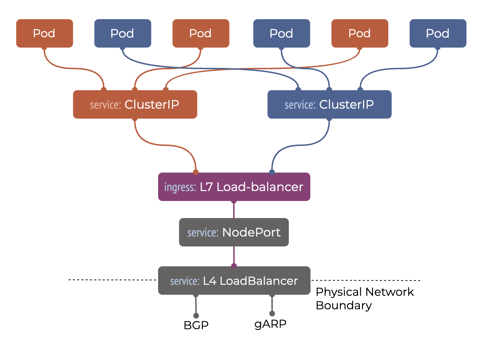

# 核心

## 网络

- CNI: 解决 Pod 与 Pod 间 IP 互通, 用于东西流量通信
  - 通过 Cilium 提供，更低延迟和更高性能
  - 不同 CNI 选择参考 [Benchmark results of Kubernetes network plugins (CNI) over 40Gbit/s network](https://itnext.io/benchmark-results-of-kubernetes-network-plugins-cni-over-40gbit-s-network-2024-156f085a5e4e)
- Service: 分布式负载均衡器
  - Headless: 通过 DNS 实现，查询 DNS 获得所有 Pod IP。通常用于 StatefulSet 负载 （Database 等），其自己处理连接
    - 通过 CoreDNS 提供
  - ClusterIP: 分配一个唯一 VIP （不能 Ping），在每个节点设置 DNAT 其负责在 Client 端转换 VIP 到 Pod ID. 通常用于 Deployment 无状态服务
    - 通过 Kubeproxy 提供
  - NodePort: 构建在 ClusterIP 之上在 root network namespace 中分配一个唯一的静态 port. 当流量从任意 node 到达此静态 port 时它会转发流量到一个健康的 Pod 上
    - 通过 Kubeproxy 提供
  - LoadBalancer: 使用外部的用户流量到达集群中。每个 LoadBalancer Service 都会分配一个可路由的 IP 通过 BGP 或者 ARP 通告底层物理网络上。通常云上提供外部 L4 负载均衡器，或者私有集群使用 MetalLB
    - 通过 MetalLB 提供
  - Service Mesh: 用于集群内应用程序间流量管理, 可观测性和安全性。常见方案有 Istio 和 Gateway API
    - 暂未提供
- Ingress & Egress: 用于集群南北流量通信
  - Ingress API: 将流量传入集群内不同服务的原始方式. 
    - 通过 Ingress Nginx 实现   
  - Gateway API: Ingress API 改进版本
    - 暂未实现
  - Egress: 缺省不进行任何限制出口流量
    - 通过 Cilium 提供
- Other
  - Network Policy: 过滤 Pod 流量, 用于限制 Pod 间通信. 通常用于隔离不同用户间 Pod 通信
    - 通过 Cilium 提供
  - DNS: 用于集群服务发现
    - 通过 CoreDNS 提供
  - TLS: 用于创建 TLS 证书，常见开启 Ingress 的 HTTPS 依赖 TLS
    - 通过 CertManager 提供

> 深入阅读 [THE KUBERNETES NETWORKING GUIDE](https://www.tkng.io/)

1. 部署 [cilium](cilium/) 用于提供 CNI 和 Networking Policies 等功能
2. 部署 [metallb](metallb/) 用于提供 LoadBalancer 服务
3. 部署 [apiserver-lb](apiserver-lb/) 用于提供 API Server 面向外部负载均衡服务
4. 部署 [nginx](nginx/) 用于提供 Nginx Ingress 服务
5. 部署 [cert-manager](cert-manager/) 用于提供 TLS 证书服务

## 存储

- CSI (Container Storage Interface)
- Volume: 容器中文件在磁盘中是临时存放的，当容器崩溃或者停止时容器中创建和修改的文件将会丢失，故而使用 Volume 解决这一问题
  - Ephemeral Volume 临时卷：与 Pod 生命周期相同, 在 Pod 停止会摧毁临时卷
    - emptyDir: 在 Pod 启动时为空，通常使用系统盘或者 RAM 中的空间
    - configMap, secret: 提供将配置挂载进 Pod 中
  - Persistent Volume 持久卷：超出 Pod 生命周期, 在 pod 停止会继续保留持久卷
    - PV (PersistentVolume ): 由管理员手动或由 StorageClass 动态创建
    - PVC (PersistentVolumeClaim): 用户的存储请求, 指定需要的存储大小或访问数据的方式
    - StorageClass: 指定存储类型

根据实际情况，添加一个或者多个存储进集群

- 部署 [local-storage](local-storage/) 用于提供本地系统盘 csi 服务, 适合缓存数据或者支持 HA 的数据库使用
- 部署 [nfs-csi](nfs-csi/) 用于提供 NFS 存储服务, 适合外部带 HA 的 NAS 服务，或者自建无 HA 的 NFS Server 小规模环境或者开发环境
- 部署 [rook](rook/) 用于提供基于 Ceph 的块存储，文件系统和对象存储服务，适合存储和计算在同一集群。如果 Ceph 存储为外部集群，则参考 [使用 Cephadm 部署 Ceph](../storage/cephadm/)
- 部署 [juicefs](juicefs/) 用于提供 JuiceFS 存储服务, 适合计算集群在云上，或者有外部提供 RDS 和对象存储的环境

### 存储性能测试

使用 [elbencho](../elbencho/README.md) 测试存储性能
