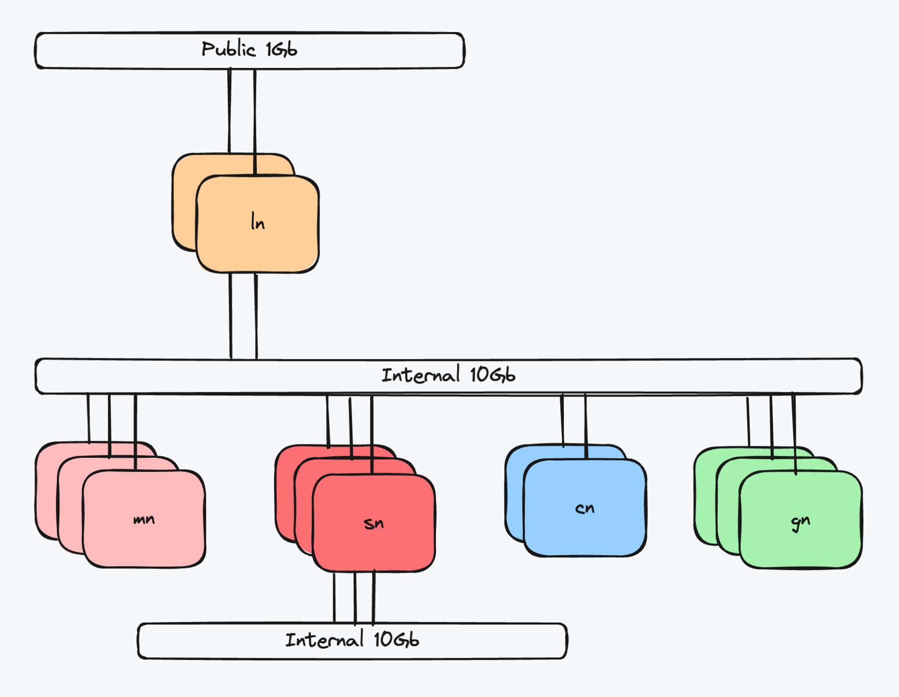

# 0 准备

## 软件与硬件



### 集群名称

* 格式：<2位字母城市缩写><1位数字序号><1位字母后缀>
* 城市缩写：例如北京 bj, 上海 sh 和广州 gz 等
* 数字序号：同一城市下使用内网互联的机房，从数字 1 开始
* 字母后缀：同一机房下区分不同集群
  * 编号 a-g: 用于内部生产集群
  * 编号 h-n: 用于用户集群
  * 编号 u-z: 用于内部测试集群
* 示例：
  * bj1a: 北京第一个机房内部生产集群
  * sh3u: 上海第三个机房内部测试集群
  * gz2h: 广州第二个机房用户集群

### DNS 命名

> example.com 为示例域名，根据实际情况进行替换

* 对外服务：*.<集群名称>.example.com, 例如 *.bj1a.example.com
* 对内服务：*.<集群名称>-int.example.com, 例如 *.bj1a-int.example.com

> int 是 internal 的缩写，表示内部服务

### 节点命名

* 管理节点：mn[01-07].<集群名称>.local, 例如 mn01.bj1a.local
  * 生产集群至少 3 节点满足 HA 需要，最大 7 节点
  * 测试集群至少 1 节点，可以与计算节点复用
* 网络负载均衡节点：ln[01-99].<集群名称>.local, 例如 ln01.bj1a.local
  * 生产集群至少 2 节点满足 HA 需要, 推荐配置独立节点 (酌情复用管理节点)
  * 测试集群复用管理节点
* 存储节点：sn[01-99].<集群名称>.local, 例如 sn01.bj1a.local
  * 生产集群至少 3 节点满足 HA 需要, 推荐配置独立节点 (酌情复用管理节点)
  * 测试集群复用管理节点
* 数据库节点：dn[01-99].<集群名称>.local, 例如 dn01.bj1a.local
  * 生产集群至少 2 节点满足 HA 需要, 推荐配置独立节点 (酌情复用管理节点)
  * 测试集群复用管理节点
* CPU 计算节点：cn[001-999].<集群名称>.local, 例如 cn001.bj1a.local
* GPU 计算节点：gn[001-999].<集群名称>.local, 例如 gn001.bj1a.local

### 网络

- 所有节点至少 10Gb 以太内网互联
- 存储节点额外提供至少 10Gb 以太网互联进行数据复制，配置此网络可以极大提供存储性能
- 提供网络负载均衡节点至少 1Gb 接入互联网，如果不面向外部提供服务此网络可选。

> 可以根据具体业务和用户需求调整网络配置。

### 软件

- OS: ubuntu 22.04
- K8S: [k3s](https://k3s.io/) v1.30
- Ceph: [ceph](https://docs.ceph.com/en/latest/releases/) v18.2

> 更多需求可以参考 [k3s requirements](https://docs.k3s.io/zh/installation/requirements)

## 所有节点初始化

> 以下均已 mn[01-03],gn001 作为代表所有节点示例

### 设置节点统一 interface 名称

> * 后续一些服务依赖一致的 interface 名称
> * 某些环境 interface 名称已统一，可以跳过

一般物理机上 interface 名称需要根据实际情况进行修改统一名称，下面是一个示例

```sh
cat << 'EOF' /etc/netplan/00-installer-config.yaml
network:
  ethernets:
    eth0:
      addresses:
      - 10.128.0.1/16
      routes:
      - to: default
        via: 10.128.255.254
      nameservers:
        addresses:
        - 223.5.5.5
        - 223.6.6.6
        - 114.114.114.114
      match:
        macaddress: fa:16:3e:f1:c3:fd
      set-name: eth0
EOF
netplan apply
```

* 如果是 bonding 设备，把 `bond0` 替换为 `eth0` 即可

### 设置节点名称

```sh
# 所有节点根据自身名字进行设置
hostnamectl set-hostname mn01.bj1a.local
```

```sh
# 在 mn01 节点配置 hosts
cat << 'EOF' >> /etc/hosts
# mn
10.128.0.1  mn01.bj1a.local mn01
10.128.0.2  mn02.bj1a.local mn02
10.128.0.3  mn03.bj1a.local mn03

# gn
10.128.1.1  gn001.bj1a.local gn001
EOF
```

### 设置 ssh 无密码登录

```sh
# 在 mn01 节点执行生成 ssh 密钥
ssh-keygen -t ecdsa
```

> ecdsa 相比 rsa 更安全，以及 rsa 被逐渐废弃

```sh
# 在 mn01 节点执行配置无密码登录
cat ~/.ssh/id_ecdsa.pub >> ~/.ssh/authorized_keys
# 在 mn01 节点同步 ssh 密钥到其他 mn 节点
rsync -avP ~/.ssh/ mn02:~/.ssh
rsync -avP ~/.ssh/ mn03:~/.ssh
# 在 mn01 节点同步 hosts 到其他 mn 节点
rsync -avP /etc/hosts mn02:/etc/hosts
rsync -avP /etc/hosts mn03:/etc/hosts

# 在 mn01 节点执行 ssh-copy 设置无密码登录其他节点
ssh-copy gn001
```

> 设置 mn 节点对等

### 管理工具 pdsh

```sh
# 所有节点执行
apt install pdsh -y

# 在 mn 节点执行
cat << 'EOF' > /etc/profile.d/pdsh.sh
export PDSH_RCMD_TYPE=ssh
EOF
source /etc/profile.d/pdsh.sh

# 在 mn01 节点生成 hosts 用于后续执行 pdsh / pdcp
cat << 'EOF' > all
mn[01-03],gn001
EOF
```

### 设置时间同步和时区

```sh
pdsh -w ^all sed -i 's/#NTP=/NTP=ntp.aliyun.com/g' /etc/systemd/timesyncd.conf
pdsh -w ^all systemctl restart systemd-timesyncd
pdsh -w ^all timedatectl timesync-status

pdsh -w ^all timedatectl set-timezone Asia/Shanghai
```

> 也可以根据需要自行搭建 ntp server

### 设置 apt 镜像

```sh
pdsh -w ^all sed -i 's@//.*archive.ubuntu.com@//mirrors.ustc.edu.cn@g' /etc/apt/sources.list
pdsh -w ^all sed -i 's/security.ubuntu.com/mirrors.ustc.edu.cn/g' /etc/apt/sources.list
pdsh -w ^all sed -i 's/http:/https:/g' /etc/apt/sources.list
pdsh -w ^all apt update
```

### 设置防火墙

```sh
pdsh -w ^all ufw disable
```

### 关闭 swap

```sh
pdsh -w ^all swapoff -a
pdsh -w ^all cp /etc/fstab /etc/fstab.bak
pdsh -w ^all "sed -i 's/^\/swap/#&/' /etc/fstab"
```

### 开启 CPU 超线程

在 BIOS 中修改后重启，在系统执行 `lscpu` 检查是否为 `Thread(s) per core: 2`

### 开启 CPU Performance Mode

> 如果在 BIOS 中已经开启，可以跳过。开启此选项极大提升性能

```sh
cat << 'EOF' > cpufrequtils
GOVERNOR="performance"
EOF
pdsh -w ^all apt install cpufrequtils -y
pdcp -w ^all cpufrequtils /etc/default
pdsh -w ^all systemctl restart cpufrequtils

# 查看当前 CPU 频率 (执行任意命令即可)
pdsh -w ^all cpufreq-info
pdsh -w ^all grep MHz /proc/cpuinfo
pdsh -w ^all cat /sys/devices/system/cpu/cpu*/cpufreq/scaling_available_governors
```

### 锁定内核版本，避免驱动失效

> 确保所有节点使用一致的内核版本后，再进行锁定

```sh
cat << 'EOF' > nolinuxupgrades
Package: linux-*
Pin: version *
Pin-Priority: -1
EOF
pdcp -w ^all nolinuxupgrades /etc/apt/preferences.d/nolinuxupgrades
```

### [推荐]关闭密码登录增强安全性

```sh
pdsh -w ^all "sed -i 's/PasswordAuthentication yes/PasswordAuthentication no/g' /etc/ssh/sshd_config.d/50-cloud-init.conf"
pdsh -w ^all systemctl reload ssh
```