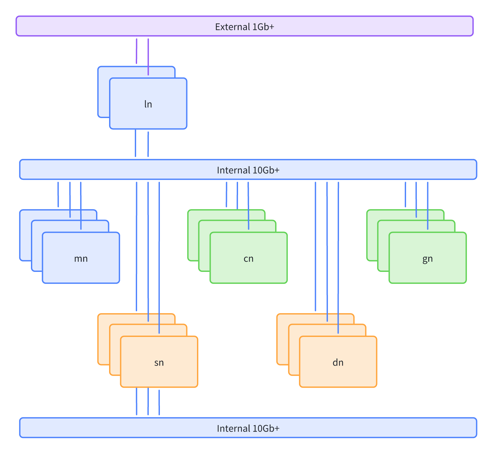

# 0 准备

## 软件与硬件



### 节点

- mn[01-03]: 提供 K8S 集群管理节点，至少 3 台以满足 HA。
- ln[01-02]: 提供 K8S 网络负载均衡服务，至少 2 台以满足 HA。
- sn[001-003]: 提供存储服务，至少 3 台以满足 HA。
- cn[001-002]：提供纯 CPU 计算负载。
- gn[001-003]：提供 GPU 计算负载。

> 集群最小集为 1 台机器。满足 HA 情况下，最小集为 3 台机器。其他功能节点根据集群大小均可以合并到 mn 节点中。

### 网络

- 所有节点至少 10Gb 以太内网互联
- 存储节点额外提供至少 10Gb 以太网互联进行数据复制，配置此网络可以极大提供存储性能
- 提供网络负载均衡节点至少 1Gb 接入互联网，如果不面向外部提供服务此网络可选。

> 可以根据具体业务和用户需求调整网络配置。

### 存储

- 至少 3 台各插入 1 块本地 SSD 存储服务器

> 如果有外置存储服务则可选，存储服务尽可能分离以避免潜在互相影响，如果条件有限可以复用 mn 节点作为存储服务器。

### 软件

- OS: ubuntu 22.04
- K8S: [k3s](https://k3s.io/) v1.29
- Ceph: [ceph](https://docs.ceph.com/en/latest/releases/) v17.2

> 更多需求可以参考 [k3s requirements](https://docs.k3s.io/zh/installation/requirements)

## 所有节点初始化

> 以下均已 mn[01-03],gn001 作为代表所有节点示例

### 设置节点统一 interface 名称

> 通常在云主机上 interface 名称已统一，可以跳过

一般物理机上 interface 名称需要根据实际情况进行修改统一名称，下面是一个示例

```sh
cat << 'EOF' /etc/netplan/00-installer-config.yaml
network:
  ethernets:
    eth0:
      addresses:
      - 10.0.3.158/22
      routes:
      - to: default
        via: 10.0.0.1
      nameservers:
        addresses:
        - 223.5.5.5
        - 223.6.6.6
        - 114.114.114.114
      match:
        macaddress: fa:16:3e:f1:c3:fd
      set-name: eth0
```

### 设置节点名称

```sh
# 所有节点根据自身名字进行设置
hostnamectl set-hostname mn01.play.local
```

> play 根据集群用途或者地域设置，例如 dev1, bj1 等

```sh
# 在 mn01 节点配置 hosts
cat << 'EOF' >> /etc/hosts
10.0.3.158  mn01.play.local mn01
10.0.0.27   mn02.play.local mn02
10.0.1.98   mn03.play.local mn03

10.0.1.51   gn001.play.local gn001
EOF
```

### 设置 ssh 无密码登录

```sh
# 在 mn01 节点执行生成 ssh 密钥
ssh-keygen -t ecdsa
```

> ecdsa 相比 rsa 更安全，以及 rsa 被逐渐废弃

```sh
# 在 mn01 节点执行配置无密码登录
cat ~/.ssh/id_ecdsa.pub >> ~/.ssh/authorized_keys
# 在 mn01 节点同步 ssh 密钥到其他 mn 节点
rsync -avP ~/.ssh/ mn02:~/.ssh
rsync -avP ~/.ssh/ mn03:~/.ssh
# 在 mn01 节点同步 hosts 到其他 mn 节点
rsync -avP /etc/hosts mn02:/etc/hosts
rsync -avP /etc/hosts mn03:/etc/hosts

# 在 mn01 节点执行 ssh-copy 设置无密码登录其他节点
ssh-copy gn001
```

> 设置 mn 节点对等

### 管理工具 pdsh

```sh
# 所有节点执行
apt install pdsh -y

# 在 mn 节点执行
cat << 'EOF' > /etc/profile.d/pdsh.sh
export PDSH_RCMD_TYPE=ssh
EOF
source /etc/profile.d/pdsh.sh

# 在 mn01 节点生成 hosts 用于后续执行 pdsh / pdcp
cat << 'EOF' > all
mn[01-03],gn001
EOF
```

### 设置时间同步和时区

```sh
pdsh -w ^all sed -i 's/#NTP=/NTP=ntp.aliyun.com/g' /etc/systemd/timesyncd.conf
pdsh -w ^all systemctl restart systemd-timesyncd
pdsh -w ^all timedatectl timesync-status

pdsh -w ^all timedatectl set-timezone Asia/Shanghai
```

> 也可以根据需要自行搭建 ntp server

### 设置防火墙

```sh
pdsh -w ^all ufw disable
```

### 开启 CPU 超线程

在 BIOS 中修改后重启，在系统执行 `lscpu` 检查是否为 `Thread(s) per core: 2`

### 开启 CPU Performance Mode

```sh
cat << 'EOF' > cpufrequtils
GOVERNOR="performance"
EOF
pdsh -w ^all apt install cpufrequtils -y
pdcp -w ^all cpufrequtils /etc/default
pdsh -w ^all systemctl restart cpufrequtils

# 查看当前 CPU 频率 (执行任意命令即可)
pdsh -w ^all cpufreq-info
pdsh -w ^all grep MHz /proc/cpuinfo
pdsh -w ^all cat /sys/devices/system/cpu/cpu*/cpufreq/scaling_available_governors
```

### 设置 apt 镜像

```sh
pdsh -w ^all sed -i 's@//.*archive.ubuntu.com@//mirrors.ustc.edu.cn@g' /etc/apt/sources.list
pdsh -w ^all sed -i 's/security.ubuntu.com/mirrors.ustc.edu.cn/g' /etc/apt/sources.list
pdsh -w ^all sed -i 's/http:/https:/g' /etc/apt/sources.list
pdsh -w ^all apt update
```

### 锁定内核版本，避免驱动失效

```sh
cat << 'EOF' > nolinuxupgrades
Package: linux-*
Pin: version *
Pin-Priority: -1
EOF
pdcp -w ^all nolinuxupgrades /etc/apt/preferences.d/nolinuxupgrades
```

### [推荐]关闭密码登录增强安全性

```sh
cat << 'EOF' > /etc/ssh/sshd_config.d/90-password.conf
PasswordAuthentication no
EOF

systemctl reload sshd
```
