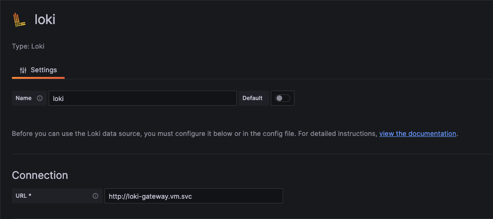
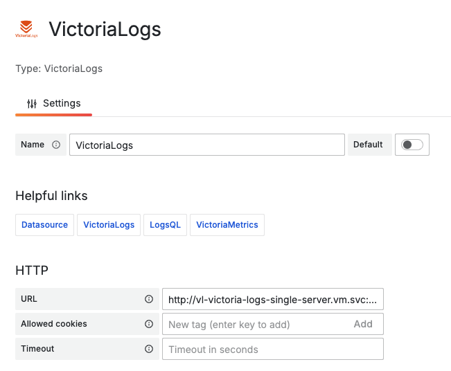
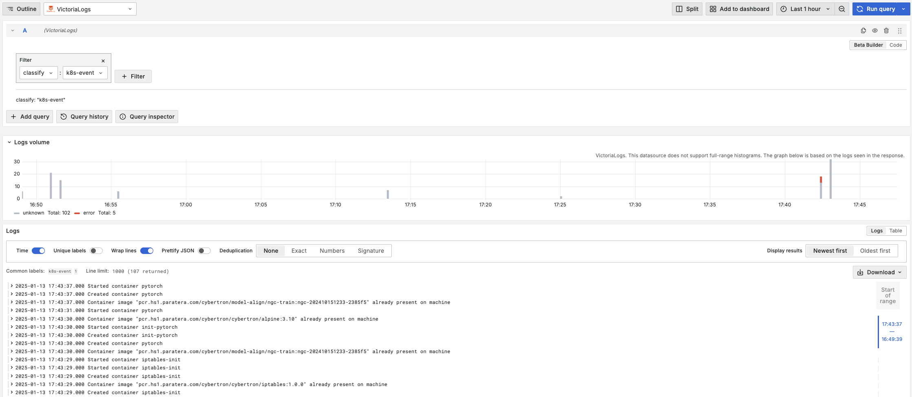

# LOGS 日志采集

* loki：grafana 的 loki 组件
  * 部署需要 对象存储支持，建议使用对象存储
  * 底层日志收集组件为 promtail
* vl: victoralogs 日志采集组件
  * grafana 查询需要安装独立的 plugins，请执行安装，可参考 vm.vm 的配置
  * 底层日志收集组件为 fluent-bit

* collectors：采集器
  * Kubernetes-event-exporter: k8s 事件采集组件
    * 已配置 往 victoralogs 中的写入，需先部署 victoralogs


> 在写入和查询上，victoralogs 更灵活 


## loki 部署

部署依赖 helm,helmwave,kubectl，请先确保相关工具已安装

具体的细节请查看子目录中的文档，这里仅说明部署步骤。


### 配置文件：

```bash
./loki
|- values
   |- _event.yml       - k8s event 收集组件配置
   |- _loki.yml        - loki 默认配置
   |- _promtail.yml    - promtail 默认配置
   |- prod.yml         - 生产环境配置
```

部署前需先准备好支持 s3 协议的对象存储，然后修改 ./loki/values/prod.yml 中的下述配置：

```yml
loki:
  ...
  storage:
    type: s3
    s3:
      endpoint: "..."                 // <-- 修改这里
      accessKeyId: "..."              // <-- 修改这里
      secretAccessKey: "..."          // <-- 修改这里
      s3ForcePathStyle: true
      insecure: true
    bucketNames:
      chunks: loki                    // <-- 修改这里(如有必要)
      ruler: loki                     // <-- 修改这里(如有必要)
      admin: loki                     // <-- 修改这里(如有必要)
```

### 部署 loki

```bash
cd loki

# build 要部署的 manafist，build 后可进行检查
./build_loki.sh

# 提交到 k8s
./up_loki.sh
```

### 部署 promtail - 节点 pod 日志收集

```bash
cd loki

# build 要部署的 manafist，build 后可进行检查
./build_promtail.sh

# 提交到 k8s
./up_promtail.sh
```

### 部署 k8s-event-exporter - k8s 事件收集

> 这里的 k8s-event-exporter 和 ./logs/collectors/kubernetes-event-exporter 本质上是一样的，可以按需部署
>
> 这里的 k8s-event-exporter 的配置只会往 loki 中写数据

```bash
cd loki

# build 要部署的 manafist，build 后可进行检查
./build_event.sh

# 提交到 k8s
./up_event.sh
```

### 在 grafana 中添加 loki 数据源

新增 loki 数据源，在 Connection 中 URL 配置 `http://loki-gateway.vm.svc`  即可

注意：本配置文件默认部署到 `vm` namespace，如果修改部署的 namespace，上述配置应做对应的修改

 

## Victorialogs 部署

部署依赖 helm,helmwave,kubectl，请先确保相关工具已安装

具体的细节请查看子目录中的文档，这里仅说明部署步骤。

### 配置文件：

```
./vml
|- values
   |- _.yml            - 默认配置
   |- prod.yml         - 生产环境配置
```

### 部署:

```bash
cd vl

# build 要部署的 manafist，build 后可进行检查
ENV=prod helmwave build --yml

# 提交到 k8s
ENV=prod helmwave up
```

> 默认的配置中已开启 fluent-bit 日志收集组件，无需额外部署

### grafana 中安装 victorialogs 查询 plugin

```yaml
# 在部署 vm.vm 时，取消以下注释即可，如果是自己部署的 grafana，参考下面的配置即可

grafana:
	...
  env:
  # 安装 victorialogs-datasource，用于查询 victorialogs 的日志
  GF_INSTALL_PLUGINS: https://github.com/VictoriaMetrics/victorialogs-datasource/releases/download/v0.3.0/victorialogs-datasource-v0.3.0.zip;victorialogs-datasource
  GF_PLUGINS_ALLOW_LOADING_UNSIGNED_PLUGINS: victorialogs-datasource

```

### grafana 中添加 VictoriaLogs 数据源

新增 VictoriaLogs 数据源，在 HTTP 中 URL 配置 `http://vl-victoria-logs-single-server.vm.svc:9428`  即可

注意：本配置文件默认部署到 `vm` namespace，如果修改部署的 namespace，上述配置应做对应的修改

 

### 部署 Kubernetes-event-exporter

如果部署了 loki，请直接部署 loki 中的 kubernetes-event-exporter

### 配置文件

配置文件位于 ./collectors/kubernetes-event-exporter/base/conf 下

关键配置：

```yaml
logLevel: debug
logFormat: json
kubeQPS: 100
kubeBurst: 500
maxEventAgeSeconds: 60
metricsNamePrefix: event_exporter_
route:
  routes:
  - match:
    - receiver: "victotialogs"
    #- receiver: "loki"

receivers:
...

- name: "victotialogs"
  # 参考：https://docs.victoriametrics.com/victorialogs/data-ingestion/fluentbit/
  webhook:
    headers: # optional
      AccountID: 0
      ProjectID: 0
    #endpoint: http://vl-victoria-logs-single-server:9428/insert/jsonline?_stream_fields=region,namespace&_msg_field=_msg&_time_field=_time
    endpoint: http://vl-victoria-logs-single-server:9428/insert/jsonline?_stream_fields=cluster,classify,namespace&_msg_field=msg&_time_field=time
    layout:

      # 自定义
      cluster  : "{{ .ClusterName }}"
      classify : "k8s-event"

      time     : "{{ .FirstTimestamp.Format \"2006-01-02T15:04:05Z\" }}"
      namespace: "{{ .InvolvedObject.Namespace }}"
      msg      : "{{ .Message }}"

      start    : "{{ .FirstTimestamp }}"
      end      : "{{ .LastTimestamp }}"
      host     : "{{ .Source.Host }}"
      component: "{{ .Source.Component }}"
        
      type     : "{{ .Type }}"
      reason   : "{{ .Reason }}"
      count    : "{{ .Count }}"
      kind     : "{{ .InvolvedObject.Kind }}"
      name     : "{{ .InvolvedObject.Name }}"
      uid      : "{{ .InvolvedObject.UID }}"
      apiVersion: "{{ .InvolvedObject.APIVersion }}"
      resourceVersion : "{{ .InvolvedObject.ResourceVersion }}"
      fieldPath: "{{ .InvolvedObject.FieldPath }}"

      labels: "{{ toJson .InvolvedObject.Labels}}"
      ownerReferences: "{{ toJson .InvolvedObject.OwnerReferences }}"
      deleted : "{{ .InvolvedObject.Deleted }}"


# - name: "loki"
#   loki:
#     headers: # optional
#       X-Scope-OrgID: 0
#       Content-Type: application/json
#     streamLabels:
#       classify: k8s-event
#     url: http://loki-gateway/loki/api/v1/push
#     layout:
#       streams:
#       - stream: 
#           namespace: "{{ .Namespace }}"
#           host     : "{{ .Source.Host }}"
#           component: "{{ .Source.Component }}"
            
#           type     : "{{ .Type }}"
#           reason   : "{{ .Reason }}"
          
#           kind     : "{{ .InvolvedObject.Kind }}"
#           name     : "{{ .InvolvedObject.Name }}"
#           uid      : "{{ .InvolvedObject.UID }}"
#           apiVersion: "{{ .InvolvedObject.APIVersion }}"
#           resourceVersion : "{{ .InvolvedObject.ResourceVersion }}"
#           fieldPath: "{{ .InvolvedObject.FieldPath }}"

#           ownerReferences: "{{ toJson .InvolvedObject.OwnerReferences }}"
#           deleted : "{{ .InvolvedObject.Deleted }}"
#         values: 
#         - [ "{{ .FirstTimestamp.Unix }}" , {message: "{{ .Message }}", labels: "{{ toJson .InvolvedObject.Labels}}", count: "{{ .Count }}"} ]

```

### 部署：

```bash
cd ./collectors/kubernetes-event-exporter/base

# build 要部署的 manafist，build 后可进行检查（主要）
./build

# 提交到 k8s
./up
```

部署后，在查询日志时使用 `classify` = `k8s-event` 即可查询 k8s 事件日志

